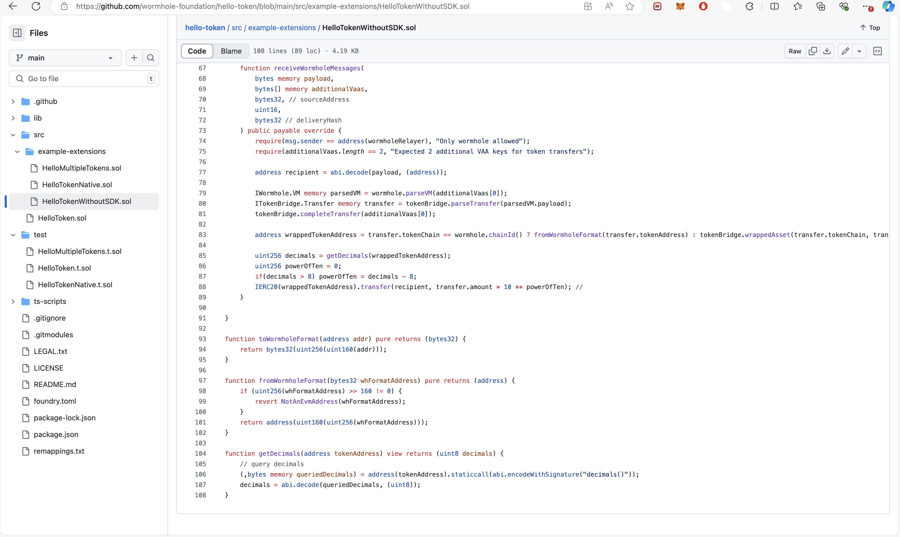

## HelloTokenWithoutSDK Issue

https://github.com/wormhole-foundation/hello-token/blob/main/src/example-extensions/HelloTokenWithoutSDK.sol 
  

  

## Tests for this Solidity contract have not been implemented.**  
No test files

## Potential Issues

During interaction with the contract token transfer following issue have been seen. 

### Error 

